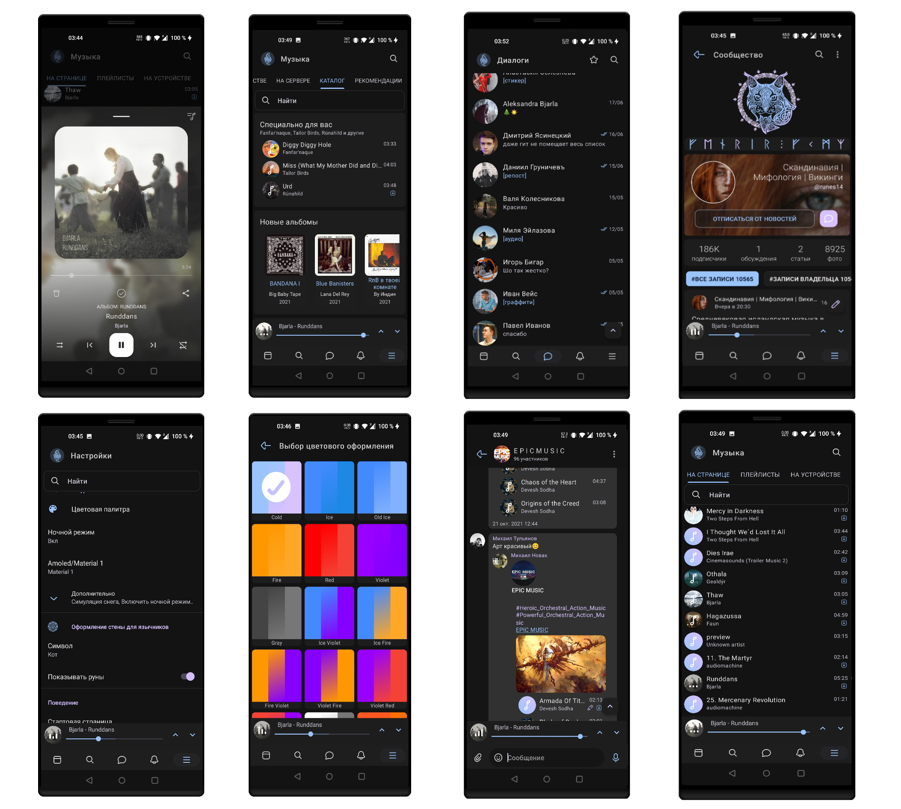

# Fenrir VK
Первый языческий

<b>Языки: Русский, английский</b>

<b>Скриншоты:</b>


<b>Инструкция по сборке:</b>
Требуется:
  1) Android Studio Arctic Fox (2020.3.1) или выше. Kotlin 1.5.*
  2) Android SDK 30
  3) Android NDK 21.4.7075529
  
  Если не работает музыка в Fenrir Kate, обновите kate_receipt_gms_token в app.build_config.
  Взять токен можно из Kate Mobile Extra Mod
  
<b>Компиляция:</b>

  1) Для релизных сборок вам нужен сертификат.
        keytool -genkey -v -keystore ExampleKey.keystore -alias fenrir -storetype PKCS12 -keyalg RSA -keysize 2048 -validity 10000
  2) Выберите тип сборки (fenrir_vk_full) Debug или Release и соберите apk :)

Локальный медиа сервер https://github.com/umerov1999/FenrirMediaServer/releases


Для target sdk 30, добавьте в манифест :
```
<uses-permission
        android:name="android.permission.WRITE_EXTERNAL_STORAGE"
        android:maxSdkVersion="29" />
<uses-permission
        android:name="android.permission.MANAGE_EXTERNAL_STORAGE"
        tools:ignore="ScopedStorage" />
```
