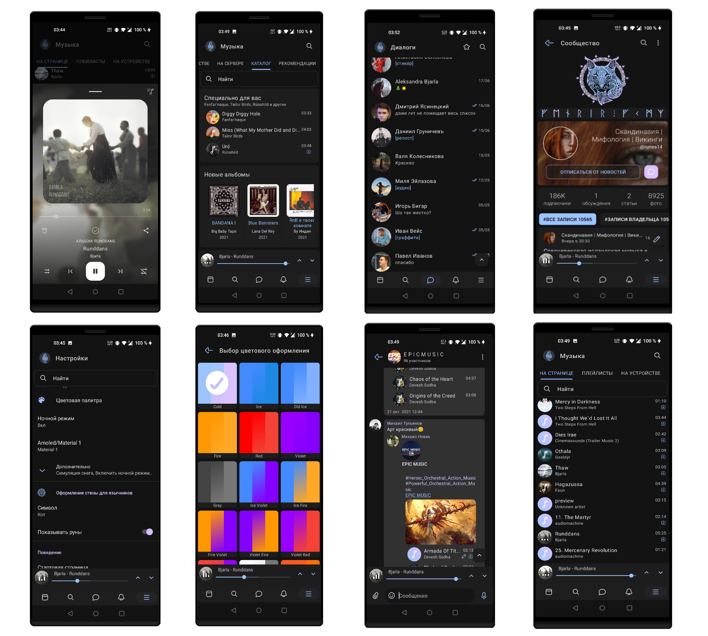
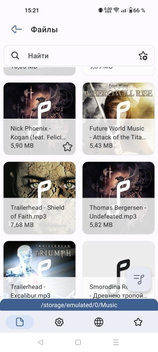

# Fenrir VK

За основу взят проект Phoenix (R) 

<b>Языки: Русский, Английский</b>

## Отказ от ответственности
Данный проект является демонстрационным вариантом и учебным пособием для разработки rest клиентов на языке Kotlin и C++ под Android,
а также интеграции современных библиотек для работы с медиа. Использовать для других целей, кроме изучения технологий, а также публиковать данную работу строго запрещено.

<b>Скриншоты:</b>

<b>Инструкция по сборке:</b> 
Требуется: 
  1. Android Studio Quail 3 2026.1.3 или выше. Kotlin 2.4.* 
  2. Android SDK 37.1 
  3. Android NDK 30.0.15729638 
  4. CMake 4.1.2 
  5. Diffutils
  
<b>Компиляция:</b>

  1. Для релизных сборок вам нужен сертификат. 
  keytool -genkey -v -keystore Fenrir.keystore -alias fenrir -storetype PKCS12 -keyalg RSA -keysize 2048 -validity 10000 
  2. Вариант 1. Далее нужно собрать нативную библиотеку: 
  Создать папку compiled_native, раскомментировать [include ":native"] в settings.gradle 
  cd native 
  ./ffmpeg.sh 
  после синхронизации репозитория ffmpeg введите min sdk version 
  после сборки ffmpeg соберите native в Android Studio и поместите native-release.aar в compiled_native 
  3. Вариант 2. Далее нужно собрать нативную библиотеку: 
  Раскомментировать [include ":native"] в settings.gradle 
  Раскомментировать [implementation project(":native")] в app*/build.gradle 
  Удалить [implementation fileTree('../compiled_native') { include '*.aar' }] в app*/build.gradle 
  cd native 
  ./ffmpeg.sh 
  после синхронизации репозитория ffmpeg введите min sdk version 
  после сборки ffmpeg можете собирать проект 
  4. Выберите flavor - fenrir или kate и Debug или Release и соберите apk :) 

Локальный медиа сервер https://github.com/umerov1999/FenrirMediaServer/releases  

# FileGallery
Просмотр фото, видео, аудио, тэги 

<b>Языки: Русский, Английский</b>

<b>Скриншот:</b>

